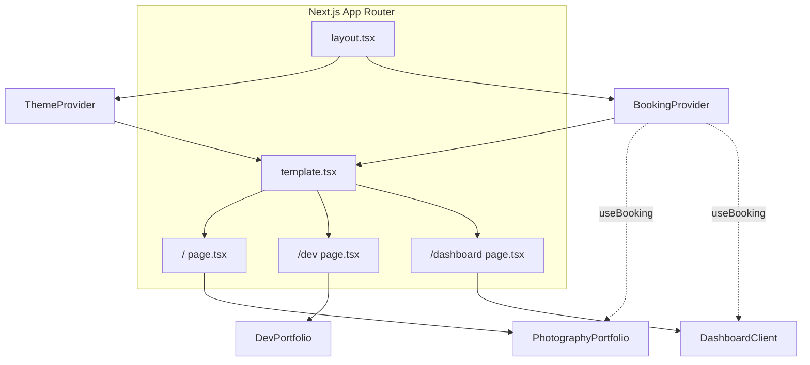
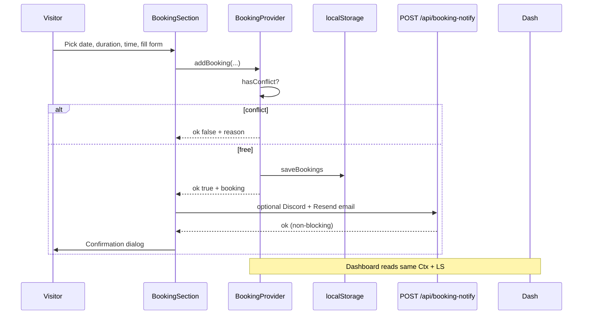

# Application documentation & workflow

This document describes how the Mark Photography portfolio is structured, how users and data flow through it, and recommended workflows for maintaining and extending the app.

---

## 1. Purpose & positioning

| Surface | Audience | Goal |
|---------|----------|------|
| **`/`** (photography) | Clients, art directors, fans of the work | Premium **Times Square**–focused gallery, transparent pricing, **self-serve booking**, contact |
| **`/dev`** (engineering) | Hiring managers, tech leads, collaborators | Projects, **case studies**, skills, hire/contact |
| **`/dashboard`** | You (studio operator) | View month’s holds, **upcoming** list, edit **client notes** (same data as booking assistant) |

Brand is consistent: same logo/name in the nav (`Navbar`), Syne + Outfit fonts, shared tokens in `globals.css`.

---

## 2. High-level architecture



- **`layout.tsx`**: fonts, `metadata`, `ThemeProvider`, **`BookingProvider`** (wraps all routes so dashboard and home share booking state).
- **`template.tsx`**: client wrapper; **`key={pathname}`** + Framer Motion so route changes animate cleanly.
- **Persistence today**: bookings are **`localStorage`** (`mark-photo-bookings-v1`, see `src/lib/booking/logic.ts`). No server database yet.

---

## 3. Route → section map

### `/` — `PhotographyPortfolio`

| Order | Section | DOM id | Role |
|------|---------|--------|------|
| 1 | Hero | `#hero` | Photo headline, CTA to `/dev`, gallery, `#booking` |
| 2 | About | `#about` | Times Square story (`AboutPhotography`) |
| 3 | Gallery | `#gallery` | Filters: All / Portraits / Street; lightbox |
| 4 | Booking | `#booking` | Calendar, duration, slots, form, confirmation dialog |
| 5 | Pricing | `#pricing` | Tiers; CTAs → `/#booking` |
| 6 | Timeline | `#timeline` | Day/night rhythm story |
| 7 | Contact | `#contact` | Form + `variant="photo"` |
| — | Marko AI | — | `MarkoAIChat` via `GlobalMarkoAgent` in root layout |

### `/dev` — `DevPortfolio`

| Order | Section | DOM id |
|------|---------|--------|
| 1 | Hero | `#hero` |
| 2 | Projects | `#projects` |
| 3 | Case studies | `#case-studies` |
| 4 | Skills | `#skills` |
| 5 | Contact | `#contact` (`variant="dev"`) |

### `/dashboard` — `DashboardClient`

- Summary cards (counts), **calendar month** list, **upcoming** sessions with **notes** (`updateNotes` on textarea blur).
- Nav includes links back to `/`, `/dev`, and `/#booking`.

---

## 4. Navigation behavior

`Navbar` uses **`usePathname()`**:

- **`/`**: anchors `/#about`, `/#gallery`, … ; pill **Dev portfolio** → `/dev`; **Book** → `/#booking`; **Dashboard** → `/dashboard`.
- **`/dev`**: anchors `/dev#…`; **Photography** → `/`; **Hire** → `/dev#contact`.
- **`/dashboard`**: **Photography**, **Development**, **New booking**; no duplicate “Book” strip from home.

Mobile menu uses **`AnimatePresence`** + `key="mobile-nav"` for enter/exit.

---

## 5. Booking system (conceptual)



- **Conflict detection**: overlapping intervals on the same **calendar night** (`src/lib/booking/logic.ts`). Sessions may start after midnight on the selected date; the **anchor night** is the chosen date with a **7:00 PM – 1:00 AM** (next calendar day) window.
- **Suggestions**: `suggestSlots` scans that evening window and returns free starts; UI uses `getEveningSlotsForUi` for the slot grid.
- **Calendar rules (UI)**: Sundays + `BLOCKED_DATES` in `BookingSection.tsx` are unavailable; past dates disabled.
- **Slot grid**: only shows starts where the full duration fits before **1:00 AM** end of the hold window.
- **Hold alerts**: after a successful save, `BookingSection` POSTs to **`/api/booking-notify`** (Discord if `DISCORD_WEBHOOK_URL`, email if `RESEND_API_KEY` + `RESEND_FROM`). Without those env vars the booking still saves locally; the API returns a warning in JSON.

---

## 6. Planned workflows

### 6.1 Content update workflow (editor / you)

1. Open **`src/lib/data.ts`**.
2. Adjust **`site`** strings, **`gallery`** (URLs + `category` + `aspect`), **`projects`**, **`caseStudies`**, **`pricingTiers`**, **`skills`**, **`sessionTypes`** as needed.
3. If you add image hosts beyond Unsplash, extend **`next.config.ts`** → `images.remotePatterns`.
4. Run **`npm run lint`** and **`npm run build`** before deploy.
5. Commit with a message that names what content changed (gallery, pricing, copy).

### 6.2 Feature change workflow (developer)

1. **Read** the section component under `src/components/sections/` or `booking/` / `portfolio/`.
2. Prefer **props** or small **variants** over duplicating whole pages (pattern: `Hero` `mode`, `Contact` `variant`).
3. Keep **client boundaries** explicit: `"use client"` only where hooks / Framer / Radix are needed; server `page.tsx` files stay thin shells.
4. If booking rules change, update **`src/lib/booking/logic.ts`** and **`BookingSection`** together; keep **`BookingRecord`** in `types.ts` in sync.
5. Respect **ESLint React Compiler** rules: avoid impure `Date.now()` inside render `useMemo`; avoid synchronous `setState` in `useEffect` where the repo uses `queueMicrotask` patterns (see `booking-context`, dashboard).

### 6.3 Release / deploy workflow

1. **`npm run build`** locally.
2. Set **`metadataBase`** in `layout.tsx` to the live URL.
3. Configure **`DISCORD_WEBHOOK_URL`** and/or **Resend** (`RESEND_API_KEY`, `RESEND_FROM`, optional **`BOOKING_INBOX_EMAIL`**) on the host if you want Marko chat pings and intelligent-hold email/Discord alerts.
4. Deploy (e.g. Vercel). Smoke-test: `/`, `/dev`, `/#booking`, `/dashboard`, theme toggle, one booking round-trip.

### 6.4 Future: server-backed booking (recommended plan)

| Phase | Work |
|-------|------|
| **A. API contract** | Define `POST /api/bookings` (create), `GET /api/bookings` (list for dashboard), optional `PATCH` for notes. |
| **B. Storage** | Postgres / Turso / Supabase table: `id`, fields from `BookingRecord`, `created_at`. Unique constraint on `(date, time)` or store `start_at`/`end_at` UTC. |
| **C. Client** | Replace `loadBookings`/`saveBookings` calls in `BookingProvider` with SWR/React Query + mutations; keep UI components. |
| **D. Auth** | Protect dashboard with NextAuth or host middleware; bookings may stay public create with rate limit + CAPTCHA. |
| **E. Notifications** | On create: **`/api/booking-notify`** already emails (Resend) + Discord for intelligent holds; extend the same pattern for a future `POST /api/bookings`. |

Until then, treat **`localStorage`** as **per-browser, per-device** demo data.

---

## 7. Key file reference

| Concern | File(s) |
|---------|---------|
| All editable copy & lists | `src/lib/data.ts` |
| Booking math & storage key | `src/lib/booking/logic.ts`, `types.ts` |
| Booking React state | `src/context/booking-context.tsx` |
| Booking UI | `src/components/booking/BookingSection.tsx` |
| Dashboard UI | `src/components/dashboard/DashboardClient.tsx` |
| Design tokens | `src/app/globals.css` |
| ShadCN-style primitives | `src/components/ui/*`, `src/lib/utils.ts` (`cn`) |
| Chat + notify APIs | `MarkoAIChat.tsx`, `GlobalMarkoAgent.tsx`, `src/app/api/contact-notify/route.ts`, **`src/app/api/booking-notify/route.ts`** |

---

## 8. Glossary

| Term | Meaning |
|------|---------|
| **Booking assistant** | The marketing name for the smart scheduler UI at `#booking`. |
| **Studio dashboard** | `/dashboard` — operational view of the same bookings. |
| **Times Square scope** | Editorial choice: gallery categories and about copy are anchored to that location; change in `data.ts` + `AboutPhotography` if you broaden. |

---

## 9. Diagram: visitor journeys (summary)

```mermaid
flowchart LR
  subgraph photo [Photography visitor]
    A[Landing /] --> B{Goal?}
    B -->|See work| G[Gallery]
    B -->|Book| K[Booking]
    B -->|Dev skills| D2[/dev]
    B -->|Message| C[Contact / Chat]
  end

  subgraph dev [Engineering visitor]
    D[/dev/] --> P[Projects]
    D --> S[Case studies]
    D --> H[Contact hire]
    D --> PH[/ Photography /]
  end
```

This file is the canonical **deep** reference; **`README.md`** stays the short onboarding entry point.

---

## 10. Changelog (recent)

### May 2026 — evening holds, pricing, Marko, notifications

- **Positioning**: Hero and site metadata emphasize **software engineer** (day) and photographer (night), not legacy “web developer” / old package pairings.
- **Packages**: Public tiers are **$449** (60 min, 30+ images, **20× 6×4" prints**) and **$699** (90 min, 45+ images, **35× 6×4" prints**); aligned with common 2025–2026 portrait **session + digitals + print bundle** bands; booking duration options and `sessionTypes` match.
- **Booking window**: Intelligent holds use **7:00 PM – 1:00 AM** on the selected night (including post-midnight starts where the math allows), implemented in `src/lib/booking/logic.ts` and the booking slot grid.
- **Hold notifications**: **`POST /api/booking-notify`** runs after a successful confirm; configure **Resend** + **`BOOKING_INBOX_EMAIL`** (optional override) and/or **`DISCORD_WEBHOOK_URL`** (see `.env.example`).
- **Marko AI**: Intro copy, header subtitle, info banner, post-capture nudge, and **quick-prompt chips** align with packages, evening window, and routing prep for Mark.
- **Pricing UI**: Removed per-card **“Reserve via Marko AI”** footers; hero copy uses richer paragraphs with an inline link to **Marko AI** instead of the old “next step” strip.
